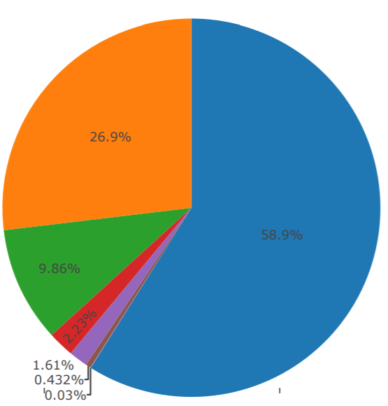

ORIE 4741 - ak633

# Evaluating Peer-to-Peer Loans from the Lending Club

The Lending Club dataset has records for a few different years, including very recent data for 2017. However, I chose to use the 2015 data because the status of loans would be more clear because there would be time to see if they were being paid on time, late, or if they were defaulted on.

I first took around 10% of my data set and did some exploratory data analysis. I chose not to use the entire data set because it was large enough to really slow down the process, and I felt that 10% would give me a rough understanding of some trends in the data. Here are a couple plots that I generated that were pretty interesting.

In the 10% of the data that I selected, I noticed that some columns had all values missing. Luckily, these were not values that I was likely to use in my model anyways. In some other rows, there were a couple missing values. I initially thought that I was going to have to impute to fill in missing values, but there are actually relatively few in the vast majority of the columns, from what I've seen so far. In trying to get 7 columns, and 40,000 rows from those columns, I only found that 1 row had at least one missing value across the 7 columns. If this sort of ratio holds through for the rest of the data, I don't think I'll have to worry about doing imputation and I can instead just remove rows that have any missing elements in the columns I'm using.

### Joint/Individual Loan Application (blue = individual, orange = joint)

### Loan Term (orange = 60 months, blue = 36 months)

### Loan Status (orange = Fully Paid, blue = Current, purple = In Grace Period, darker purple = Late (16-30 days), lighter purple = default, red = Late (31-120 days), green = Charged Off)

These are the classes I'm trying to predict for each loan application. The idea is that there might be bias in the way that humans select which features of a loan application matter the most towards whether someone is given a loan. What if they are accepting people mainly based on annual income, but there are other features that also have a strong tie to how likely the person is to pay the loan back? On the other side of the equation, maybe applicants that are likely to pay off their loan in less time should be given a lower interest rate (because there is less risk associated with the loan) or potentially you could even justify using a higher interest rate (because that allows for the company to make a bigger profit off of the loan). 

I tried a Random Forest classifier with 6 features selected from the list of features as a first pass at trying to get classifications based on the data. I figured it would be better to start off with a relatively small set and build up to more features if necessary. I got a mean accuracy of 53% across the 3 folds generated via 3-fold cross-validation. 

I should note that I was still working with only 10% of the data, and around 75% of that data was for training and 25% for testing. Eventually I'm of course going to use more of the data I have available to me, but this initial experimentation was to start getting results, and the coming weeks will be centered around getting better performance with the model.

In addition to tuning the Random Forest classifier, I want to expand outwards to other ways to classifying, including perhaps a Support Vector Machine with an RBF kernel.

Another thing I want to experiment with is using a smaller list of classes, with each one being more general. I'm currently using all 7 classes seen in the pie chart above for Loan Status, but I might turn it into 3 (early, on time, or late) or maybe even 2 (late or not). This is because some of the 7 categories have relatively small numbers of examples, and because it's likely that the difference between late 16-30 days is not abnormally different from late 31-120 days from the lender's perspective, for example.

# Loan Status with Only Two Categories (blue = good, orange = bad)

