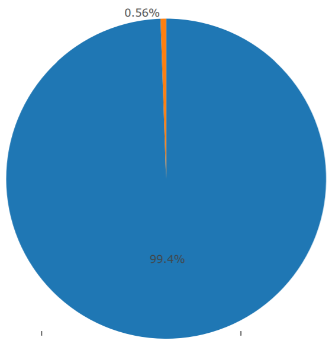

ORIE 4741 - ak633

# Evaluating Peer-to-Peer Loans from the Lending Club

The Lending Club dataset has records for a few different years, including very recent data for 2017. However, I chose to use the 2015 data because the status of loans would be more clear because there would be time to see if they were being paid on time, late, or if they were defaulted on. This property is called the loan status, and that is what I want to be able to predict among the accepted loan applications. Identifying whether accepted loan applications are resulting in people being late in paying back loans is important. It can reveal errors in the way that humans review loan applications, and can also give a rationale for the lender to be able to demand a higher interest rate.

I first took around 10% of my data set and did some exploratory data analysis. I chose not to use the entire data set because it was large enough to really slow down the process, and I felt that 10% would give me a rough understanding of some trends in the data. Here are a couple plots that I generated that were pretty interesting.

In terms of cleaning up my dataset, I have to deal with some missing values. In the 10% of the data that I selected, I noticed that some columns had all values missing. Luckily, these were not values that I was likely to use in my model anyways. In some other rows, there were a couple missing values. I initially thought that I was going to have to impute to fill in missing values, but there are actually relatively few in the vast majority of the columns, from what I've seen so far. In trying to get 7 columns, and 40,000 rows from those columns, I only found that 1 row had at least one missing value across the 7 columns. If this sort of ratio holds through for the rest of the data, I don't think I'll have to worry about doing imputation and I can instead just remove rows that have any missing elements in the columns I'm using. I've written code to do that so I can use that code even as I scale up to using higher and higher percentages of the data for training.

### Joint/Individual Loan Application (blue = individual, orange = joint)

So, it is evident from this pie chart that the vast majority of accepted loan applications are filed by an individual rather than a group of people. That might make it seem like there's no point in using this a feature in a model for predicting the lateness. However, what if all (or at least a good portion) of the accepted loan applications that were filed by a group were paid off late? That seems reasonable - it's conceivable that a group getting a loan could be late to pay back the money because you're only as timely with paying it back as the latest person in the group. If that's the case, then it would make sense to include this feature in the model. I'm going to do some digging into this to see whether it deserves to be in the model. Additionally, cross-validation of a model with this feature and a model without this feature will give insight into whether it's worth it to keep this feature in the model.

### Loan Term (orange = 60 months, blue = 36 months)

The majority of the loans in the slice of the data I selected are 36-month-term leases rather than 60-month-term leases. This means that there is less time for the interest to accumulate, but it also means the deadlines for meeting payments are more aggressive, in all likelihood. It could be interesting to see how those two conflicting directions manifest, and whether it has any bearing on whether people are late with payments. Again, I'm going to experiment with using this feature and see how it may affect the cross-validation score I get.

### Loan Status (orange = Fully Paid, blue = Current, purple = In Grace Period, darker purple = Late (16-30 days), lighter purple = default, red = Late (31-120 days), green = Charged Off)

These are the classes I'm trying to predict for each loan application. The idea is that there might be bias in the way that humans select which features of a loan application matter the most towards whether someone is given a loan. What if they are accepting people mainly based on annual income, but there are other features that also have a strong tie to how likely the person is to pay the loan back? On the other side of the equation, maybe applicants that are likely to pay off their loan in less time should be given a lower interest rate (because there is less risk associated with the loan) or potentially you could even justify using a higher interest rate (because that allows for the company to make a bigger profit off of the loan). 

I tried a Random Forest classifier with 6 features selected from the list of features as a first pass at trying to get classifications based on the data. I figured it would be better to start off with a relatively small set and build up to more features if necessary. I got a mean accuracy of 53% across the 3 folds generated via 3-fold cross-validation.

I should note that I was still working with only 10% of the data, and around 75% of that data was for training and 25% for testing. Eventually I'm of course going to use more of the data I have available to me, but this initial experimentation was to start getting results, and the coming weeks will be centered around getting better performance with the model. My model thus far has only used 6 features which is a pretty reasonable first step, although I think I need to increase the number of features I have to have the necessary amount of information provided to the classifier so it can make the right decision. There are dozens more features that are available to me, so I want to figure out which of those would be good to add in the next week or so. I haven't had to deal with regularization just yet, in part because I'm using so few features right now, but I'll have to add regularization (or pruning if I end up going with a decision tree) once I start using more features.

In addition to tuning the Random Forest classifier, I want to expand outwards to other ways to classifying, including perhaps a Support Vector Machine with an RBF kernel. I briefly tried to get an SVM classifier running, but ran in to some trouble with loading a SVM package due to some versioning issue, and I expect to fix this as soon as possible.

# Loan Status with Only Two Categories (blue = good, orange = bad)

Another thing I want to experiment with is using a smaller list of classes, with each one being more general. I'm currently using all 7 classes seen in the pie chart above for Loan Status, but I might turn it into 3 (early, on time, or late) or maybe even 2 (late or not). This is because some of the 7 categories have relatively small numbers of examples, and because it's likely that the difference between late 16-30 days is not abnormally different from late 31-120 days from the lender's perspective, for example. You can see in the pie chart above that after grouping the loan statuses into just two classes, I no longer have to worry about any of the classes having a miniscule percentage of loans in that category.

Overall, I'm seeing getting interesting, promising results so far in my exploratory data analysis and initial testing of simple models. After some more time spent on trying other models, writing functions to evaluate models using validation and cross-validation, and playing around with feature transformations, I think I should be able to get a model that is well able to predict the punctuality or lack thereof of people paying back loans.
